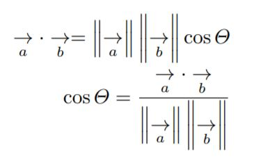

# n-gram Sentence Similarity  
**This notebook contains a set of functions that compute sentence similarity using a weighted n-gram approach as specified in https://www.cicling.org/2019/intranet/papers/paper_315.pdf**  
  
### **Approach**
- Two sentences are taken as input
- The input sentences are split into unigrams, bigrams and trigrams.
- These n-grams are embedded using a pretrained Universal Sentence Encoder Model from https://tfhub.dev/google/universal-sentence-encoder/4 
- These embedded n-grams are compared and a similarity score is obtained using cosine similarity:  

- For each unigram of sentence 1, the cosine similarity is measured with every unigram of sentence 2 and the maximum similarity is taken as the score for that unigram.
- These scores are added up for all unigrams of sentence 1 and divided by the total number of unigrams in sentence 1.  

- This score is derived for bigrams and trigrams too.
- The final similarity score is taken as the weighted sum of the scores derived for unigrams, bigrams and trigrams  

